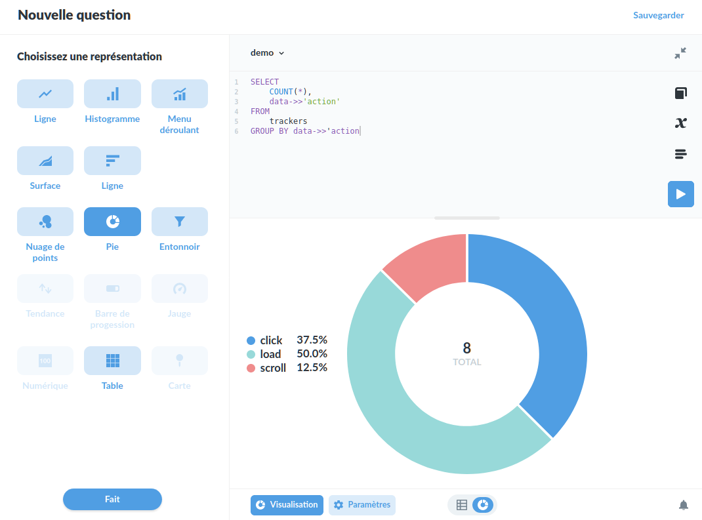

# Demonstrateur tracking Metabase
Ce dépôt contient des exemples d'implémentation afin de mettre en place une solution personalisée de suivi utilistateur et de statistiques de fréquentation.

La solution exposée utilise un _stack_ technologique courant: Python, Javascript et PostgreSQL, qui devrait pouvoir s'intégrer facilement dans n'importe quel interface ou application web (à l'exception éventuelle de l'API Python, qui peut aisément être implémenté dans d'autres langages: n'hésitez pas à en fournir un exemple !).

:construction: En Construction :construction:

## Composants:
### Tracker Javascript
Le tracker JS qui signale les événements à l'API Python
### API Python
API (Fastapi: pydantic et starlette.io) qui valide les données reçues, et les inscrit en base de données
### PostgreSQL
Base de données qui se charge du stockage des événements
### Metabase
Outil de visualisation des dnnées capables d'interroger directement la base de données, de créer et de publier des visualisation et des tableaux de bords.


## Essayer la demo
Pour lancer la démonstration, avec l'aide de [docker-compose](https://docs.docker.com/compose/), lancez la commande suivante à la raçine du projet :
```bash
~> docker-compose up
```

Une fois lancé, les prochaines interfaces seront disponibles:
- [http://localhost:5000](http://localhost:5000) l'api (avec la documentation OpenAPI disponible sur [http://localhost:5000/docs](http://localhost:5000/docs))
- [http://localhost:8080](http://localhost:8080) : une site web de démonstration équipé du tracker JS
- [http://localhost:](http://localhost:) : l'interface metabase

En parallèle, si vous disposez d'un client PostgreSQL (psql ou autre), vous pouvez vous connecter directement à la base de données (utilisateur _demo_, mot de passe _demo_, base de données "demo").

## Utilisation de Metabase
Bien que l'inscription est encore nécessaire, une fois l'accès et la DB configurée,
une requête rapide permet de vérifier le bon fonctionnement du tout (après avoir visité la page web de démonstration):
```sql
SELECT
    COUNT(*),
    data->>'action'
FROM
    trackers
GROUP BY data->>'action
```

Ce qui devrait donner un résultat semblable à ceci:



### État de la démo
- il n'y à pas encore de tableau de bord metabase preconstruit de disponible
- l'initialisation du tracker pour le site de demonstration se fait par le fichier `demo_website/js/demo_init.js`
